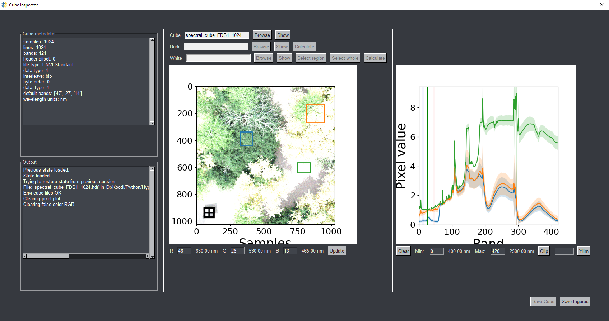

# Cube Inspector v0.2.0

Cube Inspector is a simple GUI program for inspecting and analyzing 
hyperspectral image cubes that have been saved in ENVI format.

The UI elements do have tooltips, so it should be fairly easy to decipher 
what you can do with it. Clicking on the RGB image of the cube will plot its 
spectra and click-dragging will plot mean spectra of the dragged square. 

You can calculate dark and white correction, i.e., normalizing a radiance 
cube into a reflectance cube and save the result. 

Cube Inspector tries to save your current state (image cubes and used RGB bands) 
upon closing.

Note that this is just a little software written out of necessity, 
so be prepared for crashes and weird behavior. There is an embedded 
console window to help you. 

The UI will look something like this 

## Install

Download executable file for Windows and just double click to run. 
Should work on Linux nicely, but you have to build it from source.

## New in  v0.2.0

This version fixes some annoying bugs like flicking of the image when 
interacting with it.

New features:

  - clip spectral range
  - fill rgb values with arbitrary value
  - probably other stuff I have forgotten already

## New stuff in v0.1.1

- Now you can set the range of spectrum plot to filter out bands you dont
  want to see
- Can select the bands used for RGB false color representation from the UI.
  You can also fill one or more RGB channels with an int by typing e.g. "f0" to
  fill with zero.
